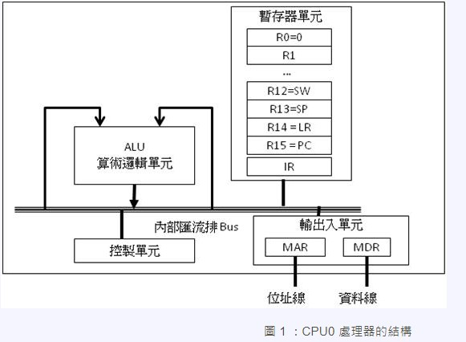
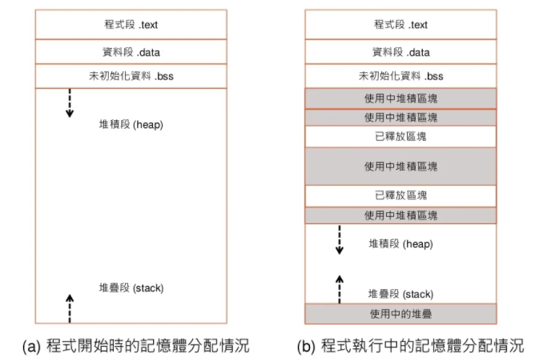
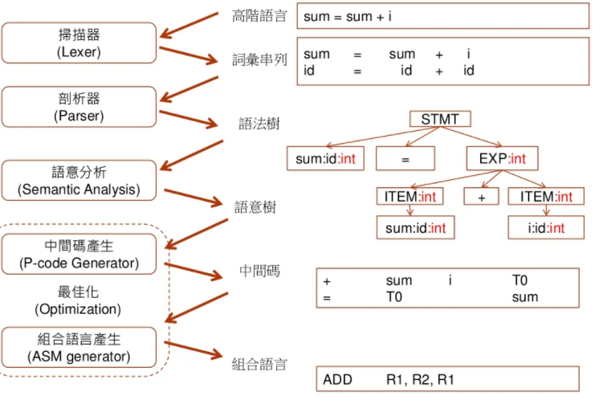

## Final (NOTES)

## Preparation 
### Install GCC 
> can be installed in Codeblock, MSYS2, WSL
## GCC or GNU C Compiler
GCC is a compiler, as the name implies, originally used to compile code in the C language. It was created by Richard Stallman, the founder of the Free Software Foundation, the forerunner of the open-source movement. GCC is part of GNU which is planned to be a Unix-like operating system, but independent, aka free. Compiling is turning the code into an executable file. In this case, for example, converting C code into Linux binary (ELF). There are several steps so that the code becomes a binary file.
* The first stage is preprocessing, which includes the defined header, in this code the stdio.h header file. To see how the preprocessing results, type the following command:

```
gcc -E hello.c
```

* The next stage is compiling, converting the preprocessing results into an assembly file. Command to generate assembly code:

```
gcc -S hello.c
```

* The next stage is assembling, converting the assembly code into an object file, usually ending in `.o`

```
gcc hello.c -o hello.o
```
This hello.o file is already in binary form and can be executed but not in the form of a program, because it is still an individual object of a class

* Then the last stage is needed, namely linking. If the program code is large, it will form many object files that must be linked to become one complete executable file.

```
gcc hello.c -o hello
```

### The Architecture of CPU0



> Table 1 CPU0 general purpose registers (GPR)

| Register |   Description                 |
|----------|-------------------------------|
| R0       | Constant register, value is 0 |
| R1-R10   | General-purpose registers     |
| R11      | Global Pointer register (GP)  |
| R12      | Frame Pointer register (FP)   |
| R13      | Stack Pointer register (SP)   |
| R14      | Link Register (LR)            |
| R15      | Status Word Register (SW)     |

> Table 2 CPU0 co-processor 0 registers (C0R)

| Register |   Description                 |
|----------|-------------------------------|
| 0        | Program Counter (PC)          |
| 1        | Error Program Counter (EPC)   |

> Table 3 CPU0 other registers

| Register |   Description                 |
|----------|-------------------------------|
| IR       | Instruction register          |
| MAR      | Memory Address Register (MAR) |
| MDR      | Memory Data Register (MDR)    |
| HI       | High part of MULT result      |
| LO       | Low part of MULT result       |

> The CPU0 Instruction Set

The Cpu0 instruction set can be divided into three types: L-type instructions, which are generally associated with memory operations, A-type instructions for arithmetic operations, and J-type instructions that are typically used when altering control flow (i.e. jumps). Fig. 4 illustrates how the bitfields are broken down for each type of instruction.


The Cpu0 has two ISA, the first ISA-I is cpu032I which hired CMP instruction from ARM; the second ISA-II is cpu032II which hired SLT instruction from Mips. The cpu032II include all cpu032I instruction set and add SLT, BEQ, …, instructions. The main purpose to add cpu032II is for instruction set design explanation. As you will see in later chapter (chapter Control flow statements), the SLT instruction will has better performance than CMP old style instruction. The following table details the cpu032I instruction set:

* First column F.: meaning Format.

| F.    | Mnemonic  | Opcode | Meaning                              | Syntax                | Operation                             |
|-------|-----------|--------|--------------------------------------|-----------------------|---------------------------------------|
|	L	|	NOP	    |	0	|	No Operation	                    |           		    |		                                |
|	L	|	LD	    |	1	|	Load word	                        |	LD Ra, [Rb+Cx]	    |	Ra <= [Rb+Cx]                   	|
|	L	|	ST	    |  	2	|	Store word	                        |	ST Ra, [Rb+Cx]	    |	[Rb+Cx] <= Ra	                    |
|	L	|	LB	    |	3	|	Load byte	                        |	LB Ra, [Rb+Cx]  	|	Ra <= (byte)[Rb+Cx] 3	            |
|	L	|	LBu	    |	4	|	Load byte unsigned	                |	LBu Ra, [Rb+Cx]	    |	Ra <= (byte)[Rb+Cx] 3	            |
|	L	|	SB	    |	5	|	Store byte	                        |	SB Ra, [Rb+Cx]	    |	[Rb+Cx] <= (byte)Ra	                |
|	L	|	LH	    |	6	|	Load half word	                    |	LH Ra, [Rb+Cx]	    |	Ra <= (2bytes)[Rb+Cx] 3	            |
|	L	|	LHu	    |	7	|	Load half word unsigned	            |	LHu Ra, [Rb+Cx]	    |	Ra <= (2bytes)[Rb+Cx] 3	            |
|	L	|	SH	    |	8	|	Store half word	                    |	SH Ra, [Rb+Cx]  	|	[Rb+Cx] <= Ra	                    |
|	L	|	ADDiu	|	9	|	Add immediate	                    |	ADDiu Ra, Rb, Cx	|	Ra <= (Rb + Cx)	                    |
|	L	|	ANDi	|	0C	|	AND imm	                            |	ANDi Ra, Rb, Cx 	|	Ra <= (Rb & Cx)	                    |
|	L	|	ORi	    |	0D	|	OR	                                |	ORi Ra, Rb, Cx	    |	Ra <= (Rb | Cx)	                    |
|	L	|	XORi	|	0E	|	XOR	                                |	XORi Ra, Rb, Cx	    |	Ra <= (Rb ^ Cx)                 	|
|	L	|	LUi	    |	0F	|	Load upper	                        |	LUi Ra, Cx	        |	Ra <= (Cx << 16)	                |
|	A	|	ADDu	|	11	|	Add unsigned	                    |	ADD Ra, Rb, Rc	    |	Ra <= Rb + Rc 4	                    |
|	A	|	SUBu	|	12	|	Sub unsigned	                    |	SUB Ra, Rb, Rc	    |	Ra <= Rb - Rc 4	                    |
|	A	|	ADD	    |	13	|	Add	                                |	ADD Ra, Rb, Rc  	|	Ra <= Rb + Rc 4	                    |
|	A	|	SUB	    |	14	|	Subtract	                        |	SUB Ra, Rb, Rc	    |	Ra <= Rb - Rc 4	                    |
|	A	|	CLZ	    |	15	|	Count Leading Zero	                |	CLZ Ra, Rb	        |	Ra <= bits of leading zero on Rb	|
|	A	|	CLO	    |	16	|	Count Leading One	                |	CLO Ra, Rb	        |	Ra <= bits of leading one on Rb	    |
|	A	|	MUL	    |	17	|	Multiply	                        |	MUL Ra, Rb, Rc	    |	Ra <= Rb * Rc	                    |
|	A	|	AND	    |	18	|	Bitwise and	                        |	AND Ra, Rb, Rc	    |	Ra <= Rb & Rc	                    |
|	A	|	OR	    |	19	|	Bitwise or	                        |	OR Ra, Rb, Rc	    |	Ra <= Rb | Rc	                    |
|	A	|	XOR	    |	1A	|	Bitwise exclusive or	            |	XOR Ra, Rb, Rc	    |	Ra <= Rb ^ Rc	                    |
|	A	|	NOR	    |	1B	|	Bitwise boolean nor	                |	NOR Ra, Rb, Rc	    |	Ra <= Rb nor Rc	                    |
|	A	|	ROL	    |	1C	|	Rotate left	                        |	ROL Ra, Rb, Cx	    |	Ra <= Rb rol Cx	                    |
|	A	|	ROR	    |	1D	|	Rotate right	                    |	ROR Ra, Rb, Cx	    |	Ra <= Rb ror Cx	                    |
|	A	|	SHL	    |	1E	|	Shift left	                        |	SHL Ra, Rb, Cx	    |	Ra <= Rb << Cx	                    |
|	A	|	SHR	    |	1F	|	Shift right	                        |	SHR Ra, Rb, Cx	    |	Ra <= Rb >> Cx	                    |
|	A	|	SRA	    |	20	|	Shift right	                        |	SRA Ra, Rb, Cx	    |	Ra <= Rb ‘>> Cx 6	                |
|	A	|	SRAV	|	21	|	Shift right	                        |	SRAV Ra, Rb, Rc	    |	Ra <= Rb ‘>> Rc 6	                |
|	A	|	SHLV	|	22	|	Shift left	                        |	SHLV Ra, Rb, Rc	    |	Ra <= Rb << Rc	                    |
|	A	|	SHRV	|	23	|	Shift right	                        |	SHRV Ra, Rb, Rc	    |	Ra <= Rb >> Rc	                    |
|	A	|	ROL	    |	24	|	Rotate left	                        |	ROL Ra, Rb, Rc	    |	Ra <= Rb rol Rc	                    |
|	A	|	ROR	    |	25	|	Rotate right	                    |	ROR Ra, Rb, Rc	    |	Ra <= Rb ror Rc	                    |
|	A	|	CMP	    |	2A	|	Compare	                            |	CMP Ra, Rb	        |	SW <= (Ra cond Rb) 5	            |
|	A	|	CMPu	|	2B	|	Compare	                            |	CMPu Ra, Rb	        |	SW <= (Ra cond Rb) 5	            |
|	J	|	JEQ	    |	30	|	Jump if equal (==)	                |	JEQ Cx	            |	if SW(==), PC <= PC + Cx	        |
|	J	|	JNE	    |	31	|	Jump if not equal (!=)	            |	JNE Cx	            |	if SW(!=), PC <= PC + Cx	        |
|	J	|	JLT	    |	32	|	Jump if less than (<)	            |	JLT Cx	            |	if SW(<), PC <= PC + Cx	            |
|	J	|	JGT	    |	33	|	Jump if greater than (>)	        |	JGT Cx	            |	if SW(>), PC <= PC + Cx	            |
|	J	|	JLE	    |	34	|	Jump if less than or equals (<=)	|	JLE Cx	            |	if SW(<=), PC <= PC + Cx	        |
|	J	|	JGE	    |	35	|	Jump if greater than or equals (>=)	|	JGE Cx	            |	if SW(>=), PC <= PC + Cx	        |
|	J	|	JMP	    |	36	|	Jump (unconditional)	            |	JMP Cx	            |	PC <= PC + Cx	                    |
|	J	|	JALR	|	39	|	Indirect jump	                    |	JALR Rb	            |	LR <= PC; PC <= Rb 7              	|
|	J	|	BAL	    |	3A	|	Branch and link                 	|	BAL Cx	            |	LR <= PC; PC <= PC + Cx	            |
|	J	|	JSUB	|	3B	|	Jump to subroutine	                |	JSUB Cx	            |	LR <= PC; PC <= PC + Cx	            |
|	J	|	JR/RET	|	3C	|	Return from subroutine	            |	JR $1 or RET LR	    |	PC <= LR 8	                        |
|	A	|	MULT	|	41	|	Multiply for 64 bits result	        |	MULT Ra, Rb	        |	(HI,LO) <= MULT(Ra,Rb)	            |
|	A	|	MULTU	|	42	|	MULT for unsigned 64 bits	        |	MULTU Ra, Rb	    |	(HI,LO) <= MULTU(Ra,Rb)	            |
|	A	|	DIV	    |	43	|	Divide	                            |	DIV Ra, Rb	        |	HI<=Ra%Rb, LO<=Ra/Rb	            |
|	A	|	DIVU	|	44	|	Divide unsigned	                    |	DIVU Ra, Rb	        |	HI<=Ra%Rb, LO<=Ra/Rb	            |       
|	A	|	MFHI	|	46	|	Move HI to GPR	                    |	MFHI Ra	            |	Ra <= HI	                        |
|	A	|	MFLO	|	47	|	Move LO to GPR	                    |	MFLO Ra	            |	Ra <= LO	                        |
|	A	|	MTHI	|	48	|	Move GPR to HI	                    |	MTHI Ra	            |	HI <= Ra	                        |
|	A	|	MTLO	|	49	|	Move GPR to LO                     	|	MTLO Ra	            |	LO <= Ra	                        |
|	A	|	MFC0	|	50	|	Move C0R to GPR	                    |	MFC0 Ra, Rb	        |	Ra <= Rb	                        |
|	A	|	MTC0	|	51	|	Move GPR to C0R	                    |	MTC0 Ra, Rb	        |	Ra <= Rb	                        |
|	A	|	C0MOV	|	52	|	Move C0R to C0R	                    |	C0MOV Ra, Rb	    |	Ra <= Rb	                        |

* The following table details the cpu032II instruction set added

| F.    | Mnemonic  | Opcode | Meaning                              | Syntax                | Operation                             |
|-------|-----------|--------|--------------------------------------|-----------------------|---------------------------------------|
|   L   |   SLTi    |   26   |  Set less Then                       |   SLTi Ra, Rb, Cx     |   Ra <= (Rb < Cx)                     |
|   L   |   SLTiu   |   27   |  SLTi unsigned                       |   SLTiu Ra, Rb, Cx    |   Ra <= (Rb < Cx)                     |
|   A   |   SLT     |   28   |  Set less Then                       |   SLT Ra, Rb, Rc      |   Ra <= (Rb < Rc)                     |
|   A   |   SLTu    |   29   |  SLT unsigned                        |   SLTu Ra, Rb, Rc     |   Ra <= (Rb < Rc)                     |
|   L   |   BEQ     |   37   |  Branch if equal                     |   BEQ Ra, Rb, Cx      |   if (Ra==Rb), PC <= PC + Cx          |
|   L   |   BNE     |   38   |  Branch if not equal                 |   BNE Ra, Rb, Cx      |   if (Ra!=Rb), PC <= PC + Cx          |

Note reference URL:

* [System Programs -- Chapter 7 High-Level Languages](https://www.slideshare.net/ccckmit/7-73472909)
* [System Programs -- Chapter 8 The Compiler](https://www.slideshare.net/ccckmit/8-73472916)


## Grammar theory

* The core "grammar theory" of higher-order languages
  * Using the generation rules BNF, EBNF to describe the grammar of the program, what is generated is a tree
  * The action of compiling or interpreting the syntax tree (literal translation), the compilation is faster than the literal translation
  * Lexical level: use regular expressions (RE: Regular Expression)
  * Statement level: use Context-free Grammar (CFG)




* Declare the variable to be placed in the data segment for the initial value
* The declared variable is not placed in the bss segment for the initial value
* malloc dynamic matrix is ​​placed in heap
* Area variable, the function return point is placed on the stack


## regular expressions

`[0-9]+(\.[0-9]*)?`: can come out 3.72, 32, 245.7191

* `[0-9]+`: choose a number from 0 to 9, choose more than 1 time
* `(\.[0-9]*)? `: (. + 0 to 9 select a number, select more than 0 times), you can choose not to execute (execute 1 or 0 times)
* In regular expressions. With special meaning (representing all characters), use. Characters need to be preceded by \
* `[a-zA-Z]`: represents all letters


````
BNF grammar (take generative math as an example)

E = N | E [+-*/] E
N = [0-9]+
This way of writing will be ambiguous, so it needs to be changed to the following way of writing

E = T | E [+-] T
T = F | T[*/]F
F = N | '(' E ')' // Add and subtract () to do it first
N = [0-9]+
BNF will have left recursion, so if you change it to EBNF, you will not fall into an infinite loop


E = T([+-]T)*
T = F ([*/] F)*
F = N | '(' E ')'
N = [0-9]+

Here's what the spanning tree looks like
(3+5)*8-6

1. BNF 2. EBNF

           E E
      E - T T - T
      T F F * F F
   T * F N (E) N N
   F (E) 6 T + T 8 6
   N E + T F F
   8 T F N N
      F N 3 5
      N 5
      3
````


## C0 language

> [System Programs -- Chapter 8 The Compiler](https://www.slideshare.net/ccckmit/8-73472916)

> Much like C but very simple programming language


The six stages of the compiler

1. Scan | Lexical Analysis

   * Divide the entire code into a basic vocabulary (token)

2. Parsing | Syntax Analysis

   * The parser uses grammar rules to compare and builds a grammar tree step by step

   * The Institute will take the exam. Here we only talk about the recursive descent method of LL, which is the EBNF written above.

3. Semantic Analysis

   * Add the node type to the grammar number, check whether the types are compatible, and then output the semantic tree to tell the system who to do it first and who to do it later

4. Intermediate code generation (Pcode Generator)

   * The semantic tree is converted into intermediate code

5. Optimization

   * Considering the configuration of the scratchpad, reducing the number of instructions and increasing efficiency, but sometimes increasing the speed code will increase
   * This is where every engineer needs to invest most, many things need to improve performance

6. Assembly Code Generator

   * Convert intermediate code to combined language output



# Code Explanation 03-compiler

`gcc genEnlish.c rlib.c` : generate executable file a.exe

`./a.exe`: executable file


##00-gen

> genEnglish.c: Generate English sentences

````c
#include "rlib.h"

// === EBNF Grammar ===== // Generate Grammar
// S = NP VP // represents a sentence
// NP = DET N // quantifier + noun
// VP = V NP // verb + quantifier + noun
// N = dog | cat // noun
// V = ​​chase | eat // verb
// DET = a | the // quantifier

char* n[] = {"dog", "cat"};
char* v[] = {"chase", "eat"};
char* det[] = {"a", "the"};

void N() {
  printf("%s", randSelect(n, 2)); // randomly select one from the n array to list, followed by the array size
}

void V() {
  printf("%s", randSelect(v, 2));
}

void DET() {
  printf("%s", randSelect(det, 2));
}

void NP() {
  DET();
  printf(" ");
  N();
}

void VP() {
  V();
  printf(" ");
  NP();
}

void S() {
  NP();
  printf(" ");
  VP();
  printf("\n");
}

int main() {
  timeSeed(); // Make the number generated each time different, use time as random number seed
  S();
}
````


> genExp.c: generate mathematical random expressions

````c
#include "rlib.h" // Use "" to reference a library that is not in the system path

void E();
void T();
void F();

// === EBNF Grammar =====
// E=T ([+-] T)* // [+-]: select + or -, ()*: (content can be repeated more than once)
// T=F ([*/] F)?
// F=[0-9] | (E) // [select one from 0 to 9] or call E above, this has recursion

// argc and argv[] receive characters from the terminal and bring them to main
int main(int argc, char * argv[]) {
    timeSeed();
    // E();
    int i;
    for (i=0; i<10; i++) {
        E();
        printf("\n");
    }
}

// E=T ([+-] T)*
void E() {
    T();
    while (randInt(10) < 3) {
       printf("%c", randChar("+-"));
       T();
    }
}

// T=F ([*/] F)?
void T() {
    F();
    if (randInt(10) < 7) {
        printf("%c", randChar("*/"));
        F();
    }
}

// F=[0-9] | (E)
void F() {
    if (randInt(10) < 8) {
        printf("%c", randChar("0123456789"));
    } else {
        printf("(");
        E();
        printf(")");
    }
}

````


> rlib.c

````c
#include "rlib.h"

// int randInt(int n): returns a random integer less than n (0,1,2..., n-1)
// Usage: randInt(5) will return one of 0, 1, 2, 3, 4
int randInt(int n) { // returns a random integer less than n (0,1,2..., n-1)
  return rand() % n;
}

// int randChar(char *set): randomly returns a character in the set
// Usage: randChar("0123456789") will return a random number
int randChar(char *set) { // return a random character from the set
  int len ​​= strlen(set); // string.h
  int i = rand()%len;
  return set[i];
}

// int randSelect(char* array, int size): randomly returns a string in the array
// Usage: randSelect({"dog", "cat"}, 2) will return a string of two choices
char *randSelect(char* array[], int size) {
  int i = rand()%size;
  return array[i];
}

void timeSeed() { // Generate random seed
  long ltime = time(NULL); // long = long int
  // printf("ltime=%ld\n", ltime);
  int stime = (unsigned) ltime/2; // transition state, this line can be omitted
  srand(stime); // srand(time(NULL)) // int long some are platform compatible and some are not
}
````


> rlib.h, .h files can be referenced by other .c files, the function type needs to be declared in it

````c
#include <stdio.h>
#include <string.h>
#include <stdlib.h>
#include <time.h>

int randInt(int n);
int randChar(char *set);
char *randSelect(char* array[], int size);
void timeSeed();
````


##01-exp0

> Arithmetic compiler


> EE.c

````c
#include <stdio.h>
void F();

// E = F
void E() {
  printf("E started\n");
  // E();
  F();
  printf("E finished\n");
}

// F = 'F'
void F() {
  printf("F started\n");
  printf("F\n");
  printf("F finished\n");
}

# mini-riscv-os

The following code needs to be downloaded if you want to execute

https://www.sifive.com/software

- Method 1 : Download Freedom Studio
- Method 2 : Download GNU Embedded Toolchain + QEMU
- Method 3: Use the environment on kinmen6.com directly ssh [guest@kinmen6.com](mailto:guest@kinmen6.com) password kinmen6110b


Read the book from scratch

- [From RISC-V processors to UNIX operating systems](https://github.com/riscv2os/riscv2os/wiki)
- Also [Resources](https://github.com/riscv2os/riscv2os/wiki/reference)


The following examples only use thread, not fork


## HelloOs

> os.c: use the code to let the development version (no operating system) pass things to the host

````c
#include <stdint.h> // specifies uint8_t // unsigned char

// set screen mapping position
#define UART 0x10000000
#define UART_THR (uint8_t*)(UART+0x00) // THR:transmitter holding register
#define UART_LSR (uint8_t*)(UART+0x05) // LSR:line status register
// 100000
#define UART_LSR_EMPTY_MASK 0x40 // LSR Bit 6: Transmitter empty; both the THR and LSR are empty

int lib_putc(char ch) {
    // Can the information be transmitted now (UART_LSR is an external modification, the hardware is responsible for operating this address) // 0000 0000 cannot be transmitted, 0100 0000 can be transmitted
while ((*UART_LSR & UART_LSR_EMPTY_MASK) == 0);
    // According to the computer protocol, the host will display the characters on the corresponding screen
return *UART_THR = ch;
}

void lib_puts(char *s) {
while (*s) lib_putc(*s++);
}

int os_main(void)
{
lib_puts("Hello OS!\n");
while (1) {}
return 0;
}
````


In the absence of an operating system, a boot program needs to be written

sp: stack scratchpad, each core has its own sp

> start.s: Enable computer core assembly language

````assembly
# Source -- https://matrix89.github.io/writes/writes/experiments-in-riscv/
.equ STACK_SIZE, 8192

.global_start

_start:
    # setup stacks per hart // hart: hardware thread, almost core, set the stack of this core
    csrr t0, mhartid # read current hart id // read the id of the core
    slli t0, t0, 10 # shift left the hart id by 1024 // t0 = t0*1024
    la sp, stacks + STACK_SIZE # set the initial stack pointer // put the stack pointer sp at the bottom of the stack
                                    # to the end of the stack space
    add sp, sp, t0 # move the current hart stack pointer // set the stack position of the hart
                                    # to its place in the stack space

    # park harts with id != 0
    csrr a0, mhartid # read current hart id
    bnez a0, park # if we're not on the hart 0 // If not on the hart 0 , enter an infinite loop.
                                    # we park the hart

    j os_main # hart 0 jump to c // The stack is set, let hart 0 enter the C language main program.

park: # Infinite loop, stop! // Make the core groups other than the 0th core do nothing
    wfi
    j park

stacks:
    .skip STACK_SIZE * 4 # allocate space for the harts stacks // allocate stack space

````


Use ld file to connect asm and c

> os.ld

````
OUTPUT_ARCH( "riscv" ) /* processor architecture is RISCV */

ENTRY( _start ) /* Entry point starts at _start */

MEMORY
{
  ram (wxa!ri) : ORIGIN = 0x80000000, LENGTH = 128M /* RAM starts from 0x80000000, total 128M BYTES */
}

PHDRS
{
  text PT_LOAD; /* text segment to be loaded*/ /* PT_LOAD (1) Indicates that this program header describes a segment to be loaded from the file. Reference -- https://ftp.gnu.org/old-gnu/ Manuals/ld-2.9.1/html_node/ld_23.html */
  data PT_LOAD; /* data segment to be loaded*/
  bss PT_LOAD; /* bss segment to be loaded */
}

SECTIONS
{
  .text : {
    PROVIDE(_text_start = .); /* Set _text_start to the beginning of the .text section. */
    *(.text.init) *(.text .text.*) /* Put all the code in this section. */
    PROVIDE(_text_end = .); /* Set _text_end to the beginning of the .text section. */
  } >ram AT>ram :text

  .rodata : { /* read-only data segment */
    PROVIDE(_rodata_start = .);
    *(.rodata .rodata.*)
    PROVIDE(_rodata_end = .);
  } >ram AT>ram :text

  .data : { /* data section */
    . = ALIGN(4096);
    PROVIDE(_data_start = .);
    *(.sdata .sdata.*) *(.data .data.*)
    PROVIDE(_data_end = .);
  } >ram AT>ram :data

  .bss :{ /* Uninitialized data section */
    PROVIDE(_bss_start = .);
    *(.sbss .sbss.*) *(.bss .bss.*)
    PROVIDE(_bss_end = .);
  } >ram AT>ram :bss

  PROVIDE(_memory_start = ORIGIN(ram));
  PROVIDE(_memory_end = ORIGIN(ram) + LENGTH(ram));
}

````


> Makefile

````makefile
CC=riscv64-unknown-elf-gcc
CFLAGS = -nostdlib -fno-builtin -mcmodel=medany -march=rv32ima -mabi=ilp32

QEMU=qemu-system-riscv32
QFLAGS = -nographic -smp 4 -machine virt -bios none

OBJDUMP=riscv64-unknown-elf-objdump

all: os.elf

os.elf: start.s os.c
    # -T specifies the link file
$(CC) $(CFLAGS) -T os.ld -o os.elf $^

# make qemu will execute the file
qemu: $(TARGET)
@qemu-system-riscv32 -M ? | grep virt >/dev/null || exit
@echo "Press Ctrl-A and then X to exit QEMU"
# QEMU is a fast virtual machine and will run out of results
$(QEMU) $(QFLAGS) -kernel os.elf

clean:
rm -f *.elf

````


##ContextSwitch

Thread switching of the operating system, switching between functions


> os.c

````c
#include "os.h"

#define STACK_SIZE 1024
uint8_t task0_stack[STACK_SIZE];
struct context ctx_os; // scratchpad for the operating system
struct context ctx_task;

extern void sys_switch();

void user_task0(void)
{
lib_puts("Task0: Context Switch Success !\n");
while (1) {} // infinite loop -- stop!
}

int os_main(void)
{
lib_puts("OS start\n");
    // To execute the function, you must first fill in ra and sp
ctx_task.ra = (reg_t) user_task0; // put into the scratchpad ra
ctx_task.sp = (reg_t) &task0_stack[STACK_SIZE-1];
    // This is written in the assembly language sys.s
sys_switch(&ctx_os, &ctx_task); // Stroke switch Task Switch, switch from os_main to user_task0
return 0;
}

````


> sys.s

````assembly
# This Code derived from xv6-riscv (64bit)
# -- https://github.com/mit-pdos/xv6-riscv/blob/riscv/kerne